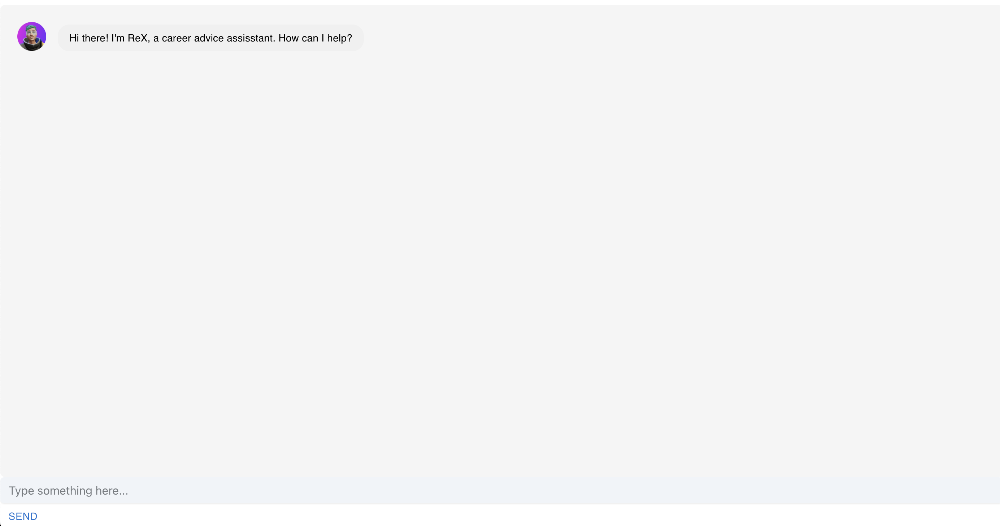
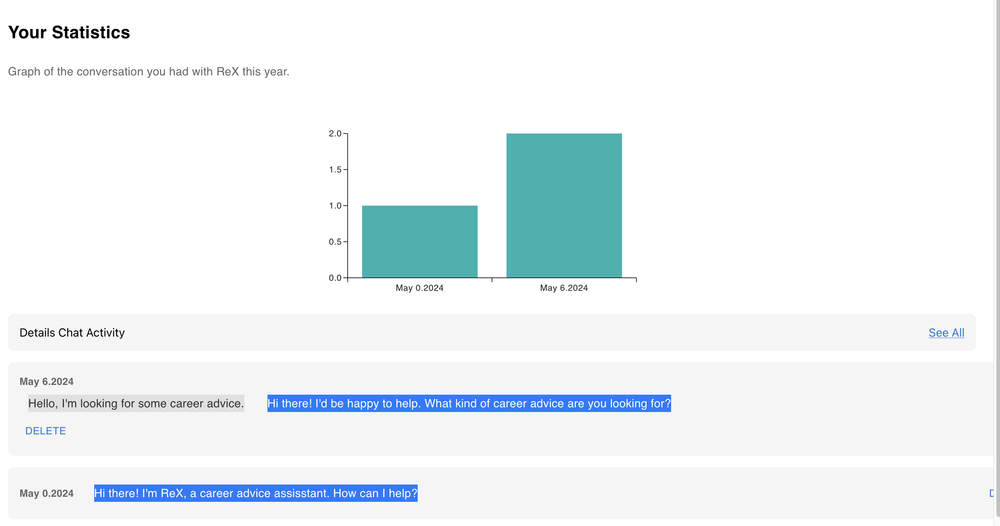

# Cosmochat UI Project

## Overview
Cosmochat UI is a project done with the RadicalAI team that aims to introduce the ReactJS framework, using it to create a functional chatbot relying on the OpenAI ChatGPT API, with a modern and interactive UI. 

When taken to the main page, you can go to either the Chat or Activity page. The Chat page is where you can talk with ReX, a career advice chatbot, and the Activity page is where you can see the amount of activity you've had with ReX.

Chat Page:


Activity Page:

## Installation
Download or clone this repo, then install all required dependencies. This can be done with:
```
git clone https://github.com/Mezwer/cosmochatui.git
npm install
```

## Run
To run this project, run this command
```
npx json-server --watch data/db.json --port 3500
```
and on a different terminal, run
```
npm start
```
This should print out the localhost link where the page is being held, where you can view the CosmoChat UI project. To go to the chat, go to the `/Chats/2` link, and to go to the activities, go to the `/Activity` link.